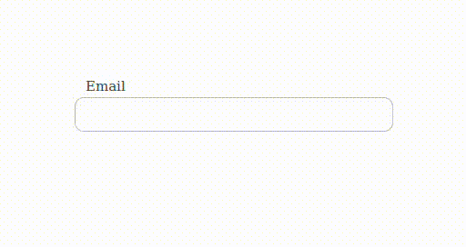

# valid-input

This npm package includes an input box with built-in validation and displays errors.



## Installation

```
npm install @harv46/valid-input
```

You can import the library directly to components

```
<script>
import { VInput } from "@harv46/valid-input";
import "@harv46/valid-input/dist/style.css";
</script>

```

## Basic usage

```js
<template>
    <div>
        <VInput v-model="inputValue" :validationType="`email`">Email</VInput>
    </div>
</template>

<script>
import { VInput } from "@harv46/valid-input";
import "@harv46/valid-input/dist/style.css";

export default {
    components: {
        VInput,
    },

    data() {
        return {
            inputValue: "",
        };
    },
};
</script>
```

### Props

| Prop             | Description                                                                  | Default |
| ---------------- | ---------------------------------------------------------------------------- | ------- |
| `type`           | Input type                                                                   | `text`  |
| `minLength`      | Minimum length validation                                                    | `0`     |
| `maxLength`      | Maximum length validation                                                    | `500`   |
| `required`       | Required validation                                                          | `false` |
| `validationType` | Type of validation using                                                     |
| `regex`          | Validation regex - if `validationType = 'regex'` See [usage](#regex-example) |
| `placeholder`    | The input placeholder attribute                                              |

## validationType values

-   email - Accepts valid email addresses.
-   alpha -Accepts only alphabet characters.
-   alphaNum - Accepts only alphanumerics.
-   numeric - Accepts only numerics. String numbers are also numeric.
-   regex - Accepts valid regular expressions, also should provide :regex property.

### Regex example

```js
<template>
    <div>
        <VInput
            v-model="inputValue"
            :minLength="4"
            :maxLength="10"
            :placeholder="Username"
            :validationType="`regex`"
            :regex="/[a-z]+/g"
            >Username</VInput
        >
    </div>
</template>

<script>
import { VInput } from "../../src/main";
import "../../dist/style.css";

export default {
    components: {
        VInput,
    },

    data() {
        return {
            inputValue: "",
        };
    },
};
</script>
```
